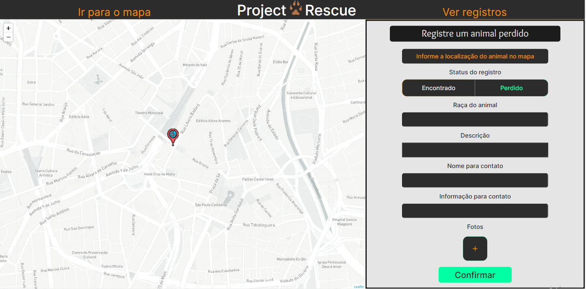

<h1 align="center">Project Rescue</h1>

<div align="center">
    
</div>

<h3 align="center">
    React/NodeJS application based on the use of the Leaflet tool, that is, a JavaScript geolocation library, for creating and viewing records of animals found and/or abandoned.
</h3>

<p align="center">
    <a href="#-about-the-project">About the project</a> •
    <a href="#-status">Status</a> • 
    <a href="#-features">Features</a> • 
    <a href="#-prerequisites">Prerequisites</a> • 
    <a href="#-applied-technologies">Applied technologies</a> • 
    <a href="#-authors">Authors</a> •
    <a href="#-readme-versions">README versions</a>
</p>

<p align="center">
    
    
    
</p>

<br/>

### 🎯 About the project

Having as main focus the fight for the reduction of the number of abandoned animals in Brazil, the Project Rescue application seeks, through the creation and visualization of records, of ample access, of found and / or abandoned animals, to unify the technology to this cause.

<hr />

### 🏁 Status

<h3 align="center">
	🚧 Project Rescue 🕹️  In progress...  🚧
</h3>

<hr />

### 🏆 Features

- [x] Create the global styles of the application;
- [x] Implement the top navigation bar component;
- [x] Add the side navigation bar component;
- [x] Implement map component;
- [x] Add the records registration form component;
- [x] Add to the application the components of displaying records of found and lost animals;
- [x] Configure the map marker, adding your design and default pop-up message positions;
- [x] Obtain the latitudinal and longitudinal data of the point on the map that the user clicked on and use them as a basis for positioning the marker;
- [x] Share positional data (latitude and longitude) between the map and the registration form;
- [ ] Perform registration data insertion in the database;
- [ ] Display the records, separated by the animal's registration status, that is, disappeared or found, for the user; and
- [ ] Implement application reponsivity;

<hr />

### ✅ Prerequisites

Hey Dev, before starting you will need to install two tools, [GIT](https://git-scm.com) and [Node.js](https://nodejs.org/en/).

In addition, of course, to a good code editor of your choice, although I strongly recommend [VSCode](https://code.visualstudio.com/).

Well, having everything installed and ready, we can proceed:

### :octocat: Cloning the project

```bash
# Clone the project repository
$ git clone <https://github.com/ThiagoBrito-Dev/Project_Rescue>

# Access the project folder through the terminal / cmd
$ cd Project_Rescue
```

### ⚙️ Running the back-end

```bash
# Access the server folder, where the backend magic happens.
$ cd server

# Install the dependencies that are located in the package.json file
$ yarn add / npm install

# Run the application
$ yarn dev

# And, for finish, access the local server on port 3000, that is, <http: // localhost: 3000>
```

### 🖥️ Running the front-end

```bash
# Go to where the magic happens
$ cd web

# Install the dependencies that are located in the package.json file
$ yarn add / npm install

# Run the application
$ yarn start

# And, finally, access the local server on port 3000, that is, <http: // localhost: 3000>
```

<hr />

### 🔮 Applied Technologies

- [HTML](https://devdocs.io/html/)
- [CSS](https://devdocs.io/css/)
- [TypeScript](https://www.typescriptlang.org/)
- [ReactJS](https://pt-br.reactjs.org/)
- [Leaflet](https://leafletjs.com/)
- [Node.js](https://nodejs.org/en/)
- [Express](https://expressjs.com/pt-br/)
- [MongoDB](https://www.mongodb.com/cloud/atlas/lp/try2?utm_source=google&utm_campaign=gs_americas_brazil_search_core_brand_atlas_desktop&utm_term=mongodb&utm_medium=cpc_paid_search&utm_ad=e&utm_ad_campaign_id=12212624308&gclid=Cj0KCQiAv6yCBhCLARIsABqJTjYiu8ZvQZLyxuv1uIqJGJDDGIv2Qju9dCqarAaLSnQIWAc1uFkB3qkaAlbIEALw_wcB)

<hr />

### 🎓 Authors

<div align="center">
    
    <h3 align="center">🤝 <a href="https://github.com/ThiagoBrito-Dev">Thiago Raniery Brito (Front-end)</a></h3>
</div>
<div align="center">
    
    <h3 align="center">🤝 <a href="https://github.com/leandro-hd">Leandro Higa Dias (Back-end)</a></h3>
</div>

<hr>

### 📚 README versions

<p>
    <a href="https://github.com/ThiagoBrito-Dev/Project_Rescue/blob/main/README.md">Portuguese (pt-br)</a>
    |
    <a href="https://github.com/ThiagoBrito-Dev/Project_Rescue/blob/main/README-en.md">English (en-us)</a>
</p>
